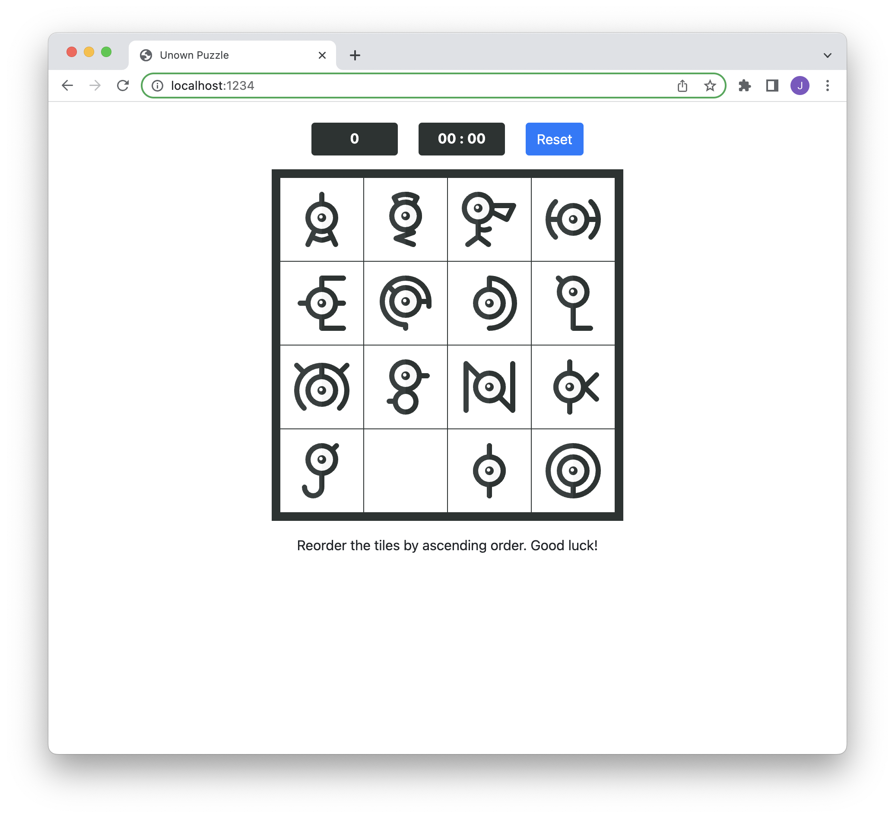

# Pokemon Puzzle Game
Pokèmon themed number puzzle game built with JavaScript.

---



App home: https://tsunghotang.github.io/pokemon-puzzle/

---

## Built With
- [JavaScript](https://reactjs.org/) - Front-end
- [Parcel](https://yarnpkg.com/package/parcel)
- [gh-pages](https://yarnpkg.com/package/gh-pages) - Deployment


## Setup Instructions
1. Install JS packages
```
yarn install
```

2. Start dev-server
```
yarn start
````

### Scripts
To start the local Webpack Dev Server (usually on port `8080`):

```bash
yarn start
```

To build production files:

```bash
yarn build
```

To deploy to GitHub Pages:
```bash
yarn create-gh-pages
```

## Todo
- Timer currently only supports 4 digits. `99:99`
- Test on Firefox and Safari
- Change endgame message from alert to modal
- Refactor code according to AirBnB eslint config
